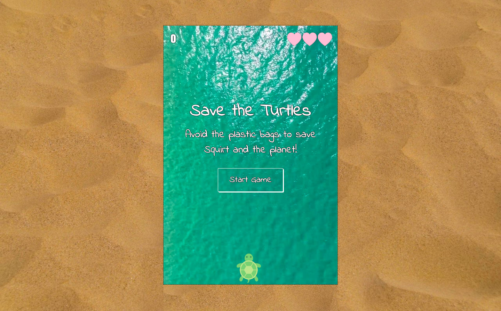

</img>

Save the Turtles is an object-oriented-programming based game created with Javascript. 

Players must avoid plastic bags or lose a life. They are able to regain a life by eating the passing jellyfish. 

Plastic bags and jellyfish both move faster down the screen as the game progresses. 

[See the game in action](https://www.youtube.com/watch?v=hohDWMbiSiU&feature=youtu.be)
